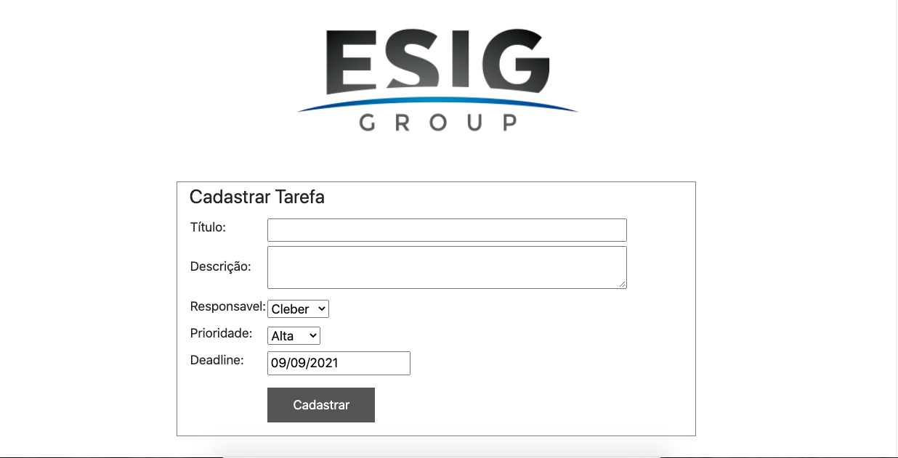

# Desafio_ESIG_JSF
repositório criado para resolver desafio da ESIG para vaga de estagio desenvolvedor JAVA.

##  Desafio
O desafio consiste em criar um CRUD utilizando JSF e PostgreSQL
	
##  Tecnologias usadas:
	
* Java
* JSF
* Hibernate
* JPA
* ApacheTomcat
* PostGreSQL
* Bootstrap
* Eclipse IDE

	
	
##   Como usar:
<b>Para rodar o projeto você deve ter uma IDE java de sua preferencia</b> 
<b>baixar o servidor Local ApacheTomCat versão 9.0.</b>
<b>Fazer download de todas as libraries do Hibernate 5.1.0 e Builda-las no Projeto,Voce tambem ira precisar de um banco de dados postgres instalado em sua maquina e deverar ver o arquivo persistence.xml e fazer as alterações necessarias para que o banco possa ter acesso aos codigos. Para que esse banco funcione no java voce precisara baixar o driver jdb do postgres para o java e tambem buida-la no projeto para que o banco consiga se comunicar com a IDE java.</b> 
<b>Logo apost ter feito tudo isso entre no navegador de sua preferencia e passe o endereço http://localhost:8080/EsigDesafio/index.xhtml e voce vera uma tela assim.</b>
	
## Tela Inicial

##   

